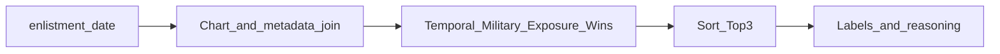

# 입대곡 추천 시스템 — 기능 명세 (Requirements)

## 1. 개요

### 1.1 목적

사용자의 **입대일**을 기준으로, 군 생활(특히 이병 시절)의 정체성을 결정짓는 **세대 구분용 입대곡**을 자동 선정한다.

### 1.2 핵심 가치

단순 차트 순위가 아니라, **군대라는 특수 환경에서의 노출 빈도**와 **집단적 기억**을 재현하는 알고리즘을 구현한다. 차트 1위 여부만으로가 아니라, 입대 전후 시기·장르·음악 방송(음방) 성과·이병 구간 차트 체류를 함께 반영한다.

---

## 2. 용어

| 기호·용어 | 정의 |
|-----------|------|
| $D$ | 사용자 **입대일** (`enlistment_date`, 달력일 기준) |
| $P$ | 곡의 **발매일** (메타데이터) |
| Golden Window | $D-14 \le P \le D+30$ (입대 전 14일 ~ 입대 후 30일) |
| Silver Window | $P < D-14$ 이고, 아래 **상위권 유지** 조건을 만족하는 경우 |
| Temporal Weight | Golden: 1.5, Silver: 1.0, 둘 다 아니면 0 또는 별도 최소값(구현 시 아래 권장값 참고) |
| Exposure Score | 입대일 이후 100일간 차트 **10위 이내**에 머문 **일수** 기반 점수 |
| Win_Count | 지상파 3사 + Mnet 음악 방송 **1위 횟수** (아래 권장 집계 범위 적용) |
| Base_Rank | 차트 순위를 점수화한 기본값(역순위 등). 아래 **권장 운영 정의** 참고 |

---

## 3. 입력·출력

### 3.1 입력 (User Input)

| 필드 | 필수 | 형식 | 설명 |
|------|------|------|------|
| `enlistment_date` | 예 | `YYYY-MM-DD` | 입대일 $D$ |
| `tone` | 아니오 | 열거형 | 출력 문체. 예: `t_plus` (T-Plus·군대식), `nostalgic` (추억 소환) |

### 3.2 출력 (Response)

구현 시 API/UI와 맞출 수 있도록 다음 필드를 권장한다.

| 필드 | 설명 |
|------|------|
| `title` | 결과 화면 상단 제목 문구 |
| `main_song` | 대표 1곡. `artist`, `title` (또는 동일 의미 필드) |
| `candidates` | 선택 배열, 최대 3개. 각 항목: 순위, 곡 정보, `total_score`, 선택적 분해( temporal, exposure, wins 등) |
| `analytics` | 문자열 배열. 시기·장르·음방·노출 등 **근거 문장** |
| `era_label` | 세대명. 예: `"당신은 확실한 [○○○] 세대입니다."` 형태 또는 `label` + `template` 분리 |

---

## 4. 시스템 데이터 요구사항

### 4.1 음악 차트

- **범위**: 2000-01-01 이후 데이터.
- **깊이**: 일간 또는 주간 차트 **TOP 20** (동일 사용자·동일 $D$에 대해 사용하는 차트 소스는 하나로 통일 권장).
- **필드**: 차트 기준일, 순위(1–20), 곡 식별자(내부 ID), 필요 시 차트 출처 코드.

### 4.2 곡 메타데이터

- 곡명, 아티스트명, **장르**(댄스/발라드/힙합 등 분류 가능해야 함), **성별·형태**(솔로/그룹, **여성 그룹(걸그룹)** 구분 가능), **발매일** $P$.

### 4.3 Impact Factor (음방 1위)

- **채널**: 지상파 3사 + Mnet.
- **집계 단위**: 곡(또는 곡+아티스트 동일 키)별 **1위 횟수**.

#### 권장: Win_Count 집계 범위 (모호성 해소)

- **권장 정의 A (기본)**: 곡별 **누적** 1위 횟수 중, **[ $D-90$, $D+100$ ]** 구간에 방영일이 속하는 횟수만 센다.  
  - 근거: 입대 전후·이병 구간과 음방 노출이 겹치는 실제를 반영한다.
- **데이터 결측 시**: 해당 곡 `Win_Count = 0`으로 두고, 근거 문장에서는 음방 항목을 생략하거나 “집계 불가” 템플릿을 사용한다.

---

## 5. 핵심 로직 및 알고리즘

### 5.1 시간적 가중치 (Temporal Weighting)

입대일 $D$, 발매일 $P$.

- **Golden Window**: $D-14 \le P \le D+30$  
  - **Temporal_Weight = 1.5**  
  - 의미: 입대 전후 가장 강하게 신곡으로 노출·기억되는 구간.

- **Silver Window**: $P < D-14$ 이고 **상위권 유지** 조건 충족 시  
  - **Temporal_Weight = 1.0**  
  - 의미: 이미 유행 중이던 곡이 입대 시점에도 차트 상위에 남아 있는 경우.

#### 권장: 「차트 상위권 유지」(Silver) 운영 정의

- 구간 **[ $D-30$, $D-1$ ]** (입대 직전 30일)에서, 해당 곡이 **TOP 20에 등장한 일수(또는 주차 수)**가 **≥ 10일**(일간 차트 기준)이면 Silver 조건의 “유지”로 본다.  
- 주간 차트만 있을 경우: 동일 30일을 주 단위로 환산해 **≥ 3주** TOP 20이면 동등 처리한다.

- Golden도 Silver도 아닌 곡: **Temporal_Weight = 0**으로 두어 순위 성분에서 제외하거나, 또는 **0.3** 등 최소 가중치를 두어 완전 탈락만 시키지 않을지는 제품 정책으로 결정한다. **권장**: 메인 파이프라인에서는 0에 가깝게 두고, **6.4절 차트 정체기** 분기에서만 스테디셀러 예외를 적용한다.

### 5.2 군 특수성 가중치 (Military Specificity)

#### 5.2.1 Genre 배수 (Genre Multiplier)

- **걸그룹(Female Group) AND 댄스(Dance) 장르**: 해당 곡에 **Genre_Multiplier = 1.5** (+50%).  
- **남성 발라드 / 힙합**: **Genre_Multiplier = 1.0** (기본값).  
- 그 외: **1.0** (필요 시 확장 테이블로 문서화).

적용 위치는 아래 최종 식과 함께 **한 가지로 고정**한다.

#### 5.2.2 Exposure Score (이병 시절 점유율)

- 구간 **[$D$, $D+100$]** (입대일 포함 100일) 동안, **일간(또는 채택한 해상도)** 차트에서 해당 곡이 **10위 이내**에 있었던 **일수**를 $days_{top10}$이라 할 때:

$$
Score_{exposure} = \frac{days_{top10}}{100} \times 100
$$

- 주간 차트만 있는 경우: 해당 주의 대표일(예: 주의 마지막일)에 TOP 10이면 그 주를 7일로 환산하거나, 주 단위 스텝으로 근사한다. 구현 시 **일간 우선**을 명시한다.

### 5.3 Base_Rank 및 Rank 성분 (권장 운영 정의)

원 명세의 $Base\_Rank$는 구현 가능하도록 아래와 같이 **권장 고정**한다.

#### 권장 Base_Rank

- 후보 곡 각각에 대해, 구간 **[ $D-14$, $D+30$ ]** 안에서 차트에 나타난 날들 중 **최고 순위**(숫자가 가장 작은 순위)를 $best\_rank$라 하면:

$$
Base\_Rank = 21 - best\_rank
$$

- 해당 구간에 차트 미진입 시 $best\_rank$를 없음으로 두고, **Base_Rank = 0** (또는 Silver 롱런만 있는 경우 §5.1 Silver 구간의 $D$일 전후 최저 순위로 대체할지 정책으로 결정). **권장**: Golden/Silver에 걸리지 않으면 본 스코어에서는 Base_Rank = 0.

이렇게 하면 1위일수록 Base_Rank가 크다.

#### Rank 성분 (Temporal · Genre 반영 후)

$$
Rank\_Component = Base\_Rank \times Temporal\_Weight \times Genre\_Multiplier
$$

### 5.4 최종 점수

$$
Total\_Score = Rank\_Component + Score_{exposure} + (Win\_Count \times 5)
$$

- 후보 곡을 $Total\_Score$ 내림차순으로 정렬하여 **Top 3**를 추출한다.
- 동점 시 권장 tie-break: (1) $Score_{exposure}$ 큰 순, (2) $Win\_Count$ 큰 순, (3) $best\_rank$ 작은 순.

### 5.5 처리 흐름 (개요)



### 5.6 의사코드 (참고)

```
입력: enlistment_date D, 차트 TOP20 시계열, 메타(발매일, 장르, 성별), 음방 1위 테이블
후보: D 전후 충분한 기간에 TOP20에 등장한 곡 집합

각 곡에 대해:
  P = 발매일
  Temporal_Weight = Golden이면 1.5, Silver이면 1.0, else 정책값
  Genre_Multiplier = (걸그룹 and 댄스) ? 1.5 : 1.0
  Base_Rank = max(0, 21 - best_rank_in_[D-14, D+30])
  Rank_Component = Base_Rank * Temporal_Weight * Genre_Multiplier
  Score_exposure = (days_in_top10_in_[D, D+100] / 100) * 100
  Win_Count = 음방 1위 횟수 in [D-90, D+100]  // 권장 구간
  Total_Score = Rank_Component + Score_exposure + Win_Count * 5

정렬 후 상위 3곡 선택
세대 라벨·근거 문장 생성 (tone에 따라 템플릿 선택)
```

---

## 6. 기능적 요구사항

### 6.1 데이터 매칭 엔진

- 입력된 `enlistment_date`와 시스템 데이터를 조인·스코어링하여 **가장 일치하는 Top 3 후보곡**을 반환한다.
- 각 후보에 대해 `Total_Score` 및 가능하면 `Rank_Component`, `Score_exposure`, `Win_Count` 기여분을 노출할 수 있어야 한다(디버깅·신뢰도용).

### 6.2 세대 라벨링

- 선정된 **대표곡(1위 후보)**을 기반으로 군 세대명을 부여한다.  
  - 예: `"텔미 세대"`, `"롤린 세대"` — **대표 콘셉트명(히트 타이틀의 짧은 별칭) + " 세대"**.  
- 구현: 별칭 매핑 테이블(곡 ID → 표시 세대 키워드) 또는 **곡명에서 괄호·부제 제거 후 앞 N글자 + " 세대"** 등 규칙을 문서화하고 유지보수한다.

### 6.3 근거 제시 (Reasoning)

다음 규칙을 **템플릿 문장**으로 매핑해 생성한다.

| 조건 | 예시 문장 방향 |
|------|----------------|
| Golden | 입대 직전·직후 신곡으로 차트에 강하게 노출 |
| Silver | 입대 전부터 이미 상위권을 유지하던 곡 |
| 걸그룹·댄스 보너스 | 휴게실·TV 노출 맥락에서 두드러진 장르 |
| Win_Count | 음방 1위 횟수 언급 (예: “○관왕”) |
| Exposure | 이병 기간 TOP10 체류 일수·비율 |

`tone`이 `t_plus`이면 군대식 호칭·어조(예: “귀하”, “관물대”, “자대”)를 사용하고, `nostalgic`이면 회상체·부드러운 어조를 사용한다.

### 6.4 예외 처리: 차트 정체기

**메가 히트 부재**로 판단하는 **권장 기준**:

- Golden Window $[D-14, D+30]$ 내에 **TOP 10 진입 이력이 있는 곡이 없음**(또는 후보 풀 전체가 매우 약함).

이 경우:

- **롱런 스테디셀러 우선**: 구간 **[ $D-60$, $D$ ]**에서 TOP 20에 **가장 많은 일수**를 기록한 곡을 후보군으로 삼고, 위 메인 식 대신 또는 보조 점수로 **유지 일수 가중치**를 높인다.  
  - 권장: 정체기 분기에서만 `Total_Score_stale = w_long * days_top20_in_[D-60,D] + Score_exposure + Win_Count*5` ( $w_long$ 은 튜닝 파라미터)로 두고, 일반 모드와 플래그를 분리한다.

### 6.5 일간/주간 혼용

- 동일 요청에서 일간·주간을 섞지 않는다. **일간 데이터가 있으면 일간 우선**이다.

---

## 7. 비기능적 요구사항

### 7.1 정확성

- 실제 군 필자 커뮤니티 밈·집단 기억과의 부합은 **초기에는 수동 샘플 검증**(입대 연도·대표곡 케이스 목록)으로 확인하고, 운영 단계에서 **사용자 피드백**(대표곡 수정 제안) 루프를 두는 것을 권장한다.

### 7.2 확장성

- 2026년 이후 신규 음원도 **동일 로직**으로 처리한다.  
- 연도 하드코딩 금지. 모든 구간은 $D$ 기준 **상대 일수**만 사용한다.

### 7.3 톤앤매너

- 결과 출력 시 `tone`에 따라 문장 세트를 선택한다.  
  - **`t_plus`**: 군대식 유머·호칭, 간결한 보고체.  
  - **`nostalgic`**: 감성·추억 소환, 과장 없이 온건한 회상.

---

## 8. 데이터 품질·가정

- **발매일 결측**: 해당 곡은 Golden/Silver 판정에서 불리하거나 제외; 정책을 하나로 정한다(권장: Temporal_Weight만 0, Base_Rank·Exposure은 유지).  
- **장르·성별 태깅 오류**: Genre_Multiplier 오판 가능 → 메타데이터 검수 프로세스 명시.  
- **차트 소스 단일성**: 가이드 차트와 실제 “군에서 틀어진” 차트는 다를 수 있음을 문서화하고, 소스 변경 시 재튜닝을 전제로 한다.

---

## 9. 샘플 출력 (Sample Output Specification)

다음은 출력 형태의 예시이다. 실제 문자열은 `tone`과 데이터에 따라 달라진다.

**Title**  
`당신의 관물대에 붙어있던 그 목소리`

**Main Song**  
`Artist_Name - Song_Title`

**Analytics** (예시)

- 자대 배치 후 TV만 틀면 나왔던 곡입니다.  
- 귀하의 일병 꺾이기 전까지 음방 8관왕을 달성했습니다.

**Era Label**  
`당신은 확실한 [○○○] 세대입니다.`

---

## 10. 기술 스택 및 프로젝트 구조

### 10.1 기술 스택 (고정)

본 제품의 구현 스택은 다음으로 **명시적으로 고정**한다.

| 영역 | 기술 |
|------|------|
| 프레임워크 | **Next.js** (App Router 권장) |
| 언어 | **TypeScript** (strict 모드 권장) |
| 백엔드·데이터 | **Supabase** (PostgreSQL, 인증·스토리지·API는 필요 시 선택적 사용) |

- **차트·메타·음방 데이터**는 Supabase **PostgreSQL** 테이블로 적재하고, 조회는 Supabase Client(서버 컴포넌트·Route Handler·Server Actions) 또는 필요 시 **RPC/뷰**로 캡슐화한다.  
- 알고리즘(점수·Top3·근거 문장 조립)은 **DB가 아닌 애플리케이션 코드**에서 수행한다(테스트·버전 관리 용이).

### 10.2 디렉터리 구조 (Java 개발자 친화 레이어)

자바의 **레이어드 아키텍처**(Presentation → Application → Domain → Infrastructure)와 대응이 쉬운 **깔끔한 구조**를 따른다. 경로는 `src/` 기준 예시이며, 실제 루트는 프로젝트 설정에 맞게 조정한다.

| 레이어 (Java 대응) | Next.js / TypeScript 위치 (권장) | 책임 |
|--------------------|-----------------------------------|------|
| **Presentation** (Controller / Web) | `src/app/` (페이지·`layout`·`loading`), `src/components/` (UI) | 입대일 입력, 결과 표시, `tone` 선택. 비즈니스 규칙 없음. |
| **Application** (Application Service / Use Case) | `src/application/` 또는 `src/usecases/` | “입대곡 추천” 단일 유스케이스 오케스트레이션: 저장소에서 데이터 로드 → 도메인 스코어링 호출 → 출력 DTO 조립. |
| **Domain** (Domain Service / 순수 로직) | `src/domain/` | 점수 공식, Golden/Silver, Exposure, `Genre_Multiplier`, 정체기 분기 등 **부수효과 없는 순수 함수·타입**. 단위 테스트의 주 대상. |
| **Infrastructure** (Repository / Adapter) | `src/infrastructure/supabase/` (또는 `src/lib/db/`) | Supabase 클라이언트 생성, 차트·메타·음방 테이블 **쿼리/매퍼**. 도메인 타입으로 변환해 반환. |

추가 규칙:

- **의존성 방향**: `app`·`components` → `application` → `domain` ← `infrastructure`에서 도메인 타입만 참조. 인프라가 앱 라우터를 import하지 않는다.  
- **공유 유틸**: 날짜·검증 등은 `src/lib/`에 두되, 도메인 규칙과 섞이지 않게 한다.  
- **환경 변수**: Supabase URL·Anon Key 등은 Next.js 관례(`NEXT_PUBLIC_` 구분)에 맞게 관리한다.

### 10.3 구현 범위와의 관계

- 본 문서 **1~9절**의 기능·알고리즘·데이터 요구는 위 스택으로 구현한다.  
- CSV 등 **초기 시드**는 별도 스크립트(예: `scripts/seed.ts`) 또는 Supabase 대시보드로 적재할 수 있으며, 런타임 추천 경로는 DB + Application + Domain으로 통일한다.

---

## 문서 이력

| 버전 | 내용 |
|------|------|
| 1.0 | 초기 기능 명세 (입대일 기반 입대곡 Top3, 점수식, 예외·톤·샘플 출력) |
| 1.1 | 기술 스택 고정 (Next.js, TypeScript, Supabase), Java 친화 레이어 구조 명시 |
